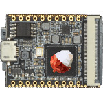

# Lichee Pi Nano

  
|Component|Description                  |
|---------|-----------------------------|
|CPU      |Allwinner F1C100S ARM9 408MHz|
|RAM      |32MB                         |
|Slot     |MicroSD                      |
|USB      |Client                       |
|Dimension|25mm x 35mm                  |
  
### https://steward-fu.github.io/website/index.htm

